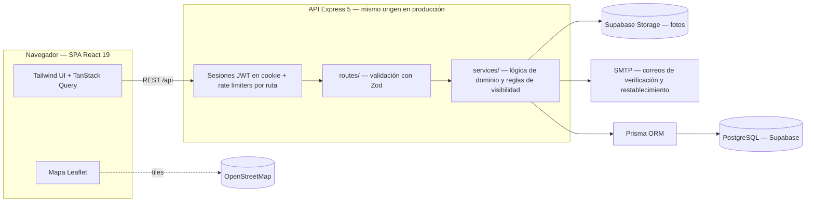

# Red de Ayudas — Plataforma comunitaria para coordinar ayuda en desastres

[Español](.) | **[English](README.md)**

[](https://ayudas-colombia.onrender.com/)
[](#tests)
[](#stack)

App web para coordinar ayuda tras un terremoto en Colombia.
Las personas reportan necesidades (personas y mascotas desaparecidas, suministros,
voluntarios, salud), quienes pueden ayudar se comprometen a
atenderlas y las organizaciones publican qué tienen y qué necesitan — todo
geolocalizado en un mapa en vivo. Un reporte queda abierto hasta que se resuelve 
(o lo cierra moderación).

**En vivo:** https://ayudas-colombia.onrender.com/ *(plan gratuito — la primera
petición puede tardar ~50 s en despertar)*

## Capturas

| | |
|---|---|
|  |  |
|  |  |

_Las capturas se tomaron con datos de prueba falsos (`npm run db:seed:dev`), no con incidentes reales._

## Por qué existe este proyecto

Cuando ocurre un desastre, la información es el recurso más escaso: las
necesidades se dispersan entre grupos de WhatsApp y redes sociales, los
voluntarios duplican esfuerzos y nadie sabe qué albergues aún tienen capacidad.
Esta plataforma centraliza esa coordinación para varias ciudades en Colombia: 
un mapa, una sola fuente de verdad, con estados para que los problemas resueltos
dejen de atraer ayuda y los pendientes ganen visibilidad.

## Funcionalidades

- **Pedidos de ayuda** — 5 tipos (persona/mascota desaparecida, suministros,
  voluntarios, salud) con urgencia, lista de artículos,
  fotos y ubicación en el mapa.
- **Ofrecimientos de ayuda** — ofertas de suministros/voluntarios/
  transporte, reclamables por usuarios y enlazables a un destino (un pedido, un
  centro de acopio o cualquier lugar).
- **Avisos por zona** — alertas comunitarias cortas que los vecinos pueden marcar.
- **Red de Ayudas** — directorio de centros de acopio, albergues, grupos de
  voluntarios y apoyo psicosocial, cada uno con **inventario en vivo** (qué tiene
  / qué necesita) y flujo de vinculación con aprobación del manager.
- **Hub de transporte** — conecta a quienes pueden trasladar suministros con
  quienes los necesitan.
- **Chat por ciudad** — tablero de mensajes por ciudad para coordinación.
- **Moderación** — reportes de la comunidad más un panel de administración con
  analítica de visitantes (serie diaria, acumulados de 7/30 días).
- **Cuentas** — verificación de correo (enlace **o** código de 6 dígitos),
  restablecimiento de contraseña, gestión de perfil, vinculación a
  organizaciones.
- **SEO** — metadatos por página, `robots.txt` y `sitemap.xml` servidos por la API.

## Arquitectura



Un repositorio, dos aplicaciones (npm workspaces): `server/` (API Express,
`routes → services → Prisma`) y `web/` (SPA React). En producción Express sirve
la SPA compilada desde `web/dist`, así que todo el producto se despliega como un
único servicio de Render — sin CORS ni hosting separado del frontend.

## Decisiones de ingeniería clave

- **Sesiones JWT en cookies HttpOnly** — el token es ilegible para payloads XSS
  (frente a localStorage); la identidad se deriva del lado del servidor vía
  `/auth/me`, incluyendo membresía y rol en organizaciones.
- **Verificación de correo doble** — un correo trae tanto un enlace de un clic
  (token de 256 bits) como un código de 6 dígitos para escribir a mano. El código
  **se bloquea tras 5 intentos fallidos** (se limpia su hash) mientras el enlace
  sigue válido como respaldo; ambos comparten una validez de 24 h y las rutas
  sensibles además llevan rate limits por IP.
- **Códigos de resolución con hash bcrypt** — quien publicó cierra/reabre su
  reporte con un código de 4 dígitos guardado como hash, nunca expuesto en los listados.
- **Reglas de visibilidad en el servidor** — datos de contacto, ofertas por
  audiencia y estados de membresía se filtran en la capa de servicios; nunca se
  le confía eso a la UI.
- **Validación en la frontera** — esquemas Zod parsean cada cuerpo de petición;
  los errores son tipados (códigos `ApiError`) y en español para el usuario.
- **Estrategia de pruebas** — 566 tests (Vitest). La suite del servidor corre
  contra un **Postgres real y aislado** (`ayudas_test`, creado y truncado
  automáticamente por test) y afirma comportamiento de la API — códigos de
  estado, payloads, permisos — no detalles de implementación.
- **Configuración fail-fast** — el servidor se niega a arrancar si `JWT_SECRET` o
  `ADMIN_TOKEN` faltan o conservan el valor de ejemplo; `TRUST_PROXY` hace que el
  rate limiting lea `X-Forwarded-For` detrás del proxy de Render.
- **Docker multietapa + Blueprint de Render** — imagen reproducible,
  infraestructura como código (`render.yaml`), Supabase para Postgres y
  almacenamiento de fotos, SMTP para correo.

## Cómo se construyó

Desarrollada con un **flujo de trabajo con agentes de IA**: la dirección de
producto, la arquitectura, el modelado de datos y cada decisión de merge fueron
mías; los agentes de código implementaron funcionalidades bajo una disciplina
estricta de pruebas primero — el trabajo solo se integra con la suite completa de
 566 tests en verde.

## Aprendizajes

- Publicar es la parte fácil; la distribución es una disciplina aparte. El
  alcance viene de los canales de comunicación — una presencia en redes sociales
  y cuentas comunitarias activas —, no solo de construir la herramienta
  correcta. Traté la distribución como una ocurrencia tardía, y eso, más que el
  código, limitó la adopción.
- Mobile-first fue una prioridad real: la UI debía verse bien y funcionar en el
  teléfono, y eso moldeó decisiones más que cualquier framework. Sin embargo,
  no diseñé en serio para conexión débil o uso sin conexión — un vacío para una
  herramienta de crisis pensada justo para esas condiciones.
- Equilibrar seguridad con la UX de crisis fue un compromiso constante: obligar
  a crear una cuenta completa causa abandono en una crisis, así que diseñé
  salvaguardas ligeras — como códigos de resolución de 4 dígitos hasheados para
  que los publicantes gestionen sus solicitudes sin cuenta, y verificación de
  correo doble que se bloquea tras 5 intentos fallidos.

## Stack

| Capa | Herramientas |
|---|---|
| Frontend | React 19, Vite, TypeScript, Tailwind CSS 4, TanStack Query 5, react-leaflet |
| Backend | Node.js 24, Express 5, TypeScript, Prisma 6, Zod 4 |
| Datos | PostgreSQL (Supabase), Supabase Storage |
| Auth | JWT (cookies HttpOnly), bcryptjs, Nodemailer |
| Pruebas | Vitest, Supertest, React Testing Library |
| Infra | Docker (multietapa), Render Blueprint, GitHub |

## Requisitos

- Node.js 24+ (ver `.nvmrc`; `engines` lo fija en `>=24`)
- Docker (para PostgreSQL local)

## Puesta en marcha

```bash
npm install
docker compose up -d          # levanta PostgreSQL
cp server/.env.example server/.env
npm run db:migrate -w server     # aplica migraciones
npm run db:seed:dev -w server    # 10 ciudades + datos de ejemplo (solo desarrollo)
npm run dev                      # API en :4000, web en :5173
```

## Tests

```bash
npm run test                  # backend + frontend (requiere PostgreSQL arriba)
```

Los tests de backend usan una base `ayudas_test` separada (creada y sincronizada
automáticamente por el setup de Vitest).

## Producción

El despliegue usa la imagen Docker multietapa (`Dockerfile`) y el blueprint de
Render (`render.yaml`). El servidor compila la API y sirve el frontend desde
`web/dist` cuando `NODE_ENV=production`.

### Variables de entorno

Todas las variables están documentadas en `server/.env.example`. Para
producción, pon `NODE_ENV=production` y reemplaza los valores de ejemplo de
abajo por valores reales. El servidor **revienta al arrancar** si `JWT_SECRET` o
`ADMIN_TOKEN` faltan o siguen siendo los valores de ejemplo.

#### Obligatorias

| Variable | Descripción |
| --- | --- |
| `NODE_ENV` | `development` en local; poner `production` en producción |
| `DATABASE_URL` | PostgreSQL de producción (no la local de Docker) |
| `JWT_SECRET` | Secreto para firmar las sesiones; no debe ser el valor de ejemplo |
| `ADMIN_TOKEN` | Token para las rutas de moderación; no debe ser el valor de ejemplo |
| `SMTP_URL` | SMTP para verificar correo y restablecer contraseña (p. ej. Brevo) |
| `MAIL_FROM` | Remitente de los correos (debe ser una dirección verificada) |

#### Opcionales

| Variable | Descripción |
| --- | --- |
| `PORT` | Puerto del servidor (por defecto 4000) |
| `TRUST_PROXY` | Activa detrás de un proxy inverso para que los límites de tasa lean `X-Forwarded-For` |
| `CORS_ORIGIN` | Origins permitidos, separados por coma; vacío = sin CORS (mismo origen) |
| `FRONTEND_URL` | URL pública del frontend para los enlaces de los correos; usa `RENDER_EXTERNAL_URL` si falta |
| `SUPABASE_URL` | Supabase Storage para las fotos; sin él se guardan como base64 en la base de datos |
| `SUPABASE_SECRET_KEY` | Service key de Supabase |
| `SUPABASE_BUCKET` | Bucket de Supabase (por defecto `fotos`, debe ser público) |

### Despliegue rápido (Render + Supabase)

1. Sube el repo; Render construye la imagen del `Dockerfile` a partir del
   blueprint `render.yaml` (o crea el servicio manualmente apuntando al repo).
2. Crea el Postgres de producción (p. ej. Supabase) y aplica las migraciones
   contra su URL directa (puerto 5432): `npm run db:deploy -w server` y luego
   `npm run db:seed:prod -w server`, que siembra únicamente las 10 ciudades.
   **Nunca** uses `npm run db:seed:dev` contra producción: borra todos los datos
   y crea datos de ejemplo (es un script exclusivo de desarrollo).
3. En la consola de Render completa antes de que termine el primer deploy los
   secretos con `sync: false` en `render.yaml`: `DATABASE_URL` (con el pooler,
   puerto 6543), `JWT_SECRET`, `ADMIN_TOKEN`, `SMTP_URL`, `MAIL_FROM` (dirección
   verificada), `SUPABASE_URL` y `SUPABASE_SECRET_KEY`; el `SUPABASE_BUCKET` ya lo
   fija el blueprint en `fotos` (el bucket debe ser público) y `FRONTEND_URL`
   puede quedar vacío (usa `RENDER_EXTERNAL_URL`). `TRUST_PROXY` lo activa el
   blueprint (el límite de tasa lee `X-Forwarded-For`).

## Flujo de trabajo

Cada commit deja la app funcionando con tests en verde. Las migraciones de Prisma se
versionan en `server/prisma/migrations/`.
