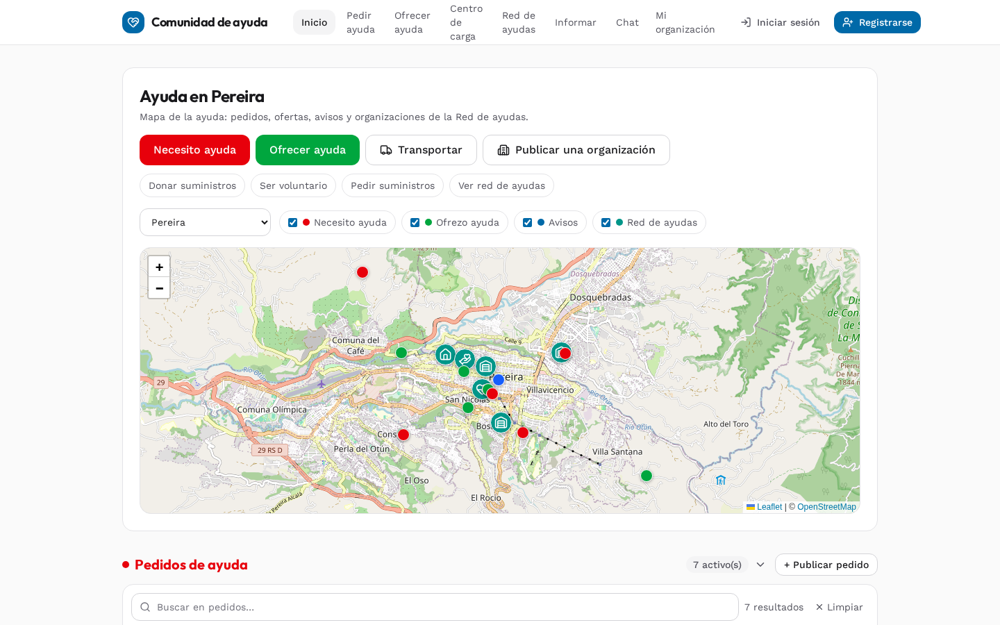
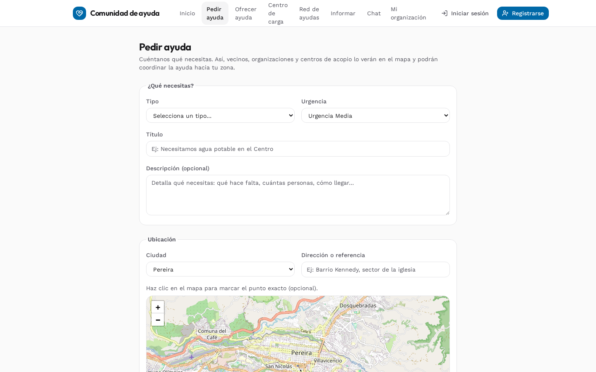
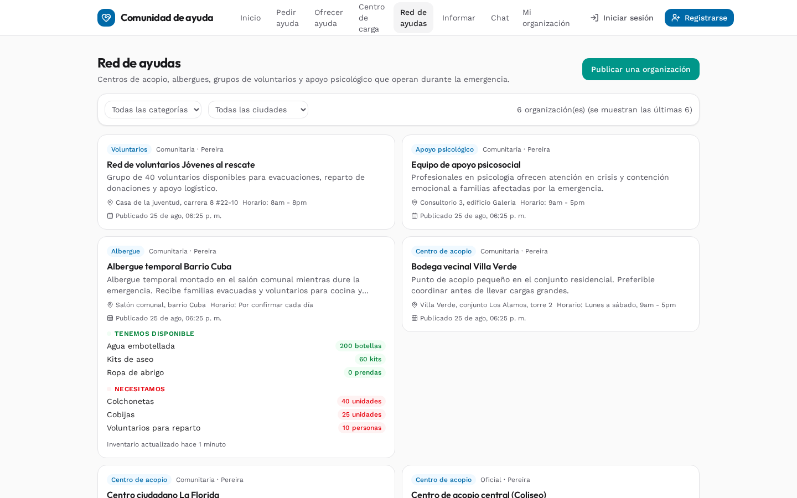
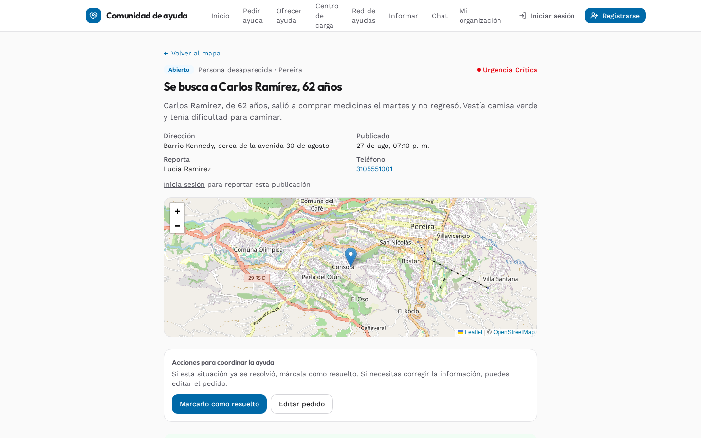
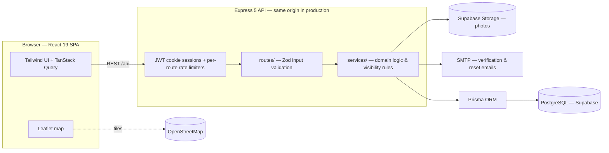

# Red de Ayudas — Community Disaster Relief Platform

**English** | [Español](README.es.md)

[](https://ayudas-colombia.onrender.com/)
[](#testing)
[](#tech-stack)

A full-stack web platform for coordinating help after an earthquake in Colombia.
People report needs (missing people and pets, supplies, volunteers, medical help),
those who can help commit to fulfilling them, and aid organizations publish what
they have and what they need — all geo-located on a live map. A report stays open until
it is resolved (or closed by moderation).

**Live:** https://ayudas-colombia.onrender.com/ *(free tier — first request may take ~50s to wake up)*

## Screenshots

| | |
|---|---|
|  |  |
|  |  |

_Screenshots are captured against fake development seed data (`npm run db:seed:dev`), not real incidents._

## Why this project exists

When a disaster hits, information is the scarcest resource: needs scatter across
WhatsApp groups and social media, volunteers duplicate work, and nobody knows which
shelters still have capacity. This platform centralizes that coordination for the
several cities in Colombia: one map, one source of truth, with statuses so
solved problems stop attracting help and unsolved ones get visibility.

## Features

- **Help requests** — 5 types (missing person/pet, supplies, volunteers,
  medical) with urgency, item lists, photos and map location.
- **Help offers** — supplies/volunteers/transport offers, linkable to a destination
 (a request, a collection center, or anywhere).
- **Zone alerts (avisos)** — short-lived community warnings markable by neighbors.
- **Aid network (Red de Ayudas)** — directory of collection centers, shelters,
  volunteer groups and psychological support teams, each with **live inventory**
  (what they have / what they need) and a join-with-approval membership flow.
- **Transport hub** — matches people who can move supplies with those who need it.
- **City chat** — per-city message board for coordination.
- **Moderation** — community reports plus an admin dashboard with visitor
  analytics (daily series, 7/30-day rollups).
- **Accounts** — email verification (link **or** 6-digit code), password reset,
  profile management, org membership.
- **SEO** — per-page meta tags, `robots.txt` and `sitemap.xml` served by the API.

## Architecture



One repo, two apps (npm workspaces): `server/` (Express API, `routes → services →
Prisma`) and `web/` (React SPA). In production Express serves the built SPA from
`web/dist`, so the whole product deploys as a single Render service — no CORS, no
separate web host.

## Key engineering decisions

- **JWT sessions in HttpOnly cookies** — session tokens are unreadable to XSS
  payloads (vs. localStorage); identity is derived server-side from `/auth/me`,
  including org membership and role.
- **Dual email verification** — one email carries both a one-click link (256-bit
  token) and a 6-digit code for manual entry. The code **locks after 5 failed
  attempts** (its hash is cleared) while the link stays valid as a fallback; both
  share a 24h TTL, and sensitive routes carry per-IP rate limits on top.
- **bcrypt-hashed resolve codes** — posters close/reopen their own reports with a
  4-digit code stored as a hash, never exposed in listings.
- **Server-side visibility rules** — contact info, audience-targeted offers and
  membership states are filtered in the service layer, never trusted to the UI.
- **Validation at the boundary** — Zod schemas parse every request body; errors
  are typed (`ApiError` codes) and user-facing in Spanish.
- **Test strategy** — 566 tests (Vitest). The server suite runs against a **real,
  isolated Postgres** (`ayudas_test`, auto-created and truncated per test) and
  asserts API behavior — status codes, payloads, permission checks — not
  implementation details.
- **Fail-fast configuration** — the server refuses to boot if `JWT_SECRET` or
  `ADMIN_TOKEN` are missing or left at example values; `TRUST_PROXY` makes rate
  limiting read `X-Forwarded-For` behind Render's proxy.
- **Docker multi-stage + Render Blueprint** — reproducible image, infra-as-code
  (`render.yaml`), Supabase for Postgres and photo storage, SMTP for mail.

## How it was built

Developed with an **AI-agent workflow**: product direction, architecture, data
modeling and every merge decision were mine; coding agents implemented features
under a strict test-first discipline — work only lands with the full 566-test
suite green.

## Learnings

- Shipping is the easy part; distribution is a separate discipline. Reach comes
  from communication channels — a social-media presence and active community
  accounts — not just from building the right tool. I treated distribution as an
  afterthought, and that, more than the code, capped adoption.
- Mobile-first was a real priority: the UI had to look good and work on phones,
  and that shaped decisions more than any framework choice. I did **not**,
  however, seriously design for weak-connectivity or offline use — a gap for a
  crisis tool meant for exactly those conditions.
- Balancing security with crisis UX was a constant trade-off: forcing full
  account creation causes drop-off in a crisis, so I had to design lightweight
  safeguards — like 4-digit hashed resolve codes so posters could manage their
  requests without an account, and dual email verification that locks after 5
  failed attempts.

## Tech stack

| Layer | Tools |
|---|---|
| Frontend | React 19, Vite, TypeScript, Tailwind CSS 4, TanStack Query 5, react-leaflet |
| Backend | Node.js 24, Express 5, TypeScript, Prisma 6, Zod 4 |
| Data | PostgreSQL (Supabase), Supabase Storage |
| Auth | JWT (HttpOnly cookies), bcryptjs, Nodemailer |
| Testing | Vitest, Supertest, React Testing Library |
| Infra | Docker (multi-stage), Render Blueprint, GitHub |

## Getting started

Requirements: **Node.js 24+** (see `.nvmrc`) and **Docker** (for local PostgreSQL).

```bash
npm install
docker compose up -d              # start PostgreSQL
cp server/.env.example server/.env
npm run db:migrate -w server      # apply migrations
npm run db:seed:dev -w server     # 10 cities + demo data (development only)
npm run dev                       # API on :4000, web on :5173
```

## Testing

```bash
npm test                          # server + web suites (needs PostgreSQL running)
```

Backend tests use a dedicated `ayudas_test` database, created and kept in sync
automatically by the Vitest setup, and truncated between tests.

## Production

Deployment uses the multi-stage Docker image and the Render blueprint
(`render.yaml`). The server builds the API and serves the frontend from
`web/dist` when `NODE_ENV=production`.

### Environment variables

All variables are documented in `server/.env.example`. For production, set
`NODE_ENV=production` and replace the example values below with real ones. The
server **crashes on boot** if `JWT_SECRET` or `ADMIN_TOKEN` are missing or still
the example values.

#### Required

| Variable | Description |
| --- | --- |
| `NODE_ENV` | `development` locally; set to `production` in production |
| `DATABASE_URL` | Production PostgreSQL (not the local Docker one) |
| `JWT_SECRET` | Session signing secret; must not be the example value |
| `ADMIN_TOKEN` | Token for moderation routes; must not be the example value |
| `SMTP_URL` | SMTP for email verification and password reset (e.g. Brevo) |
| `MAIL_FROM` | Sender address (must be a verified sender) |

#### Optional

| Variable | Description |
| --- | --- |
| `PORT` | Server port (default 4000) |
| `TRUST_PROXY` | Enable behind a reverse proxy so rate limits read `X-Forwarded-For` |
| `CORS_ORIGIN` | Allowed origins, comma-separated; empty = no CORS (same origin) |
| `FRONTEND_URL` | Public frontend URL for email links; falls back to `RENDER_EXTERNAL_URL` |
| `SUPABASE_URL` | Supabase Storage for photos; without it photos are stored as base64 in the DB|
| `SUPABASE_SECRET_KEY` | Supabase service key |
| `SUPABASE_BUCKET` | Supabase bucket (default `fotos`, must be public) |

### Quick deploy (Render + Supabase)

1. Push the repo; Render builds the `Dockerfile` image from the `render.yaml`
   blueprint (or create the service manually pointing at the repo).
2. Create the production Postgres (e.g. Supabase) and apply migrations against
   its direct URL (port 5432): `npm run db:deploy -w server`, then
   `npm run db:seed:prod -w server`, which seeds only the cities. **Never** run
   `npm run db:seed:dev` against production: it wipes all data and inserts demo
   content (development-only script).
3. In the Render console, before the first deploy finishes, fill the `sync: false`
   secrets from `render.yaml`: `DATABASE_URL` (with the pooler, port 6543),
   `JWT_SECRET`, `ADMIN_TOKEN`, `SMTP_URL`, `MAIL_FROM` (verified address),
   `SUPABASE_URL` and `SUPABASE_SECRET_KEY`; `SUPABASE_BUCKET` is fixed by the
   blueprint to `fotos` (bucket must be public), `FRONTEND_URL` can stay empty
   (uses `RENDER_EXTERNAL_URL`), and `TRUST_PROXY` is enabled by the blueprint so
   rate limiting reads `X-Forwarded-For`.

## Workflow

Every commit leaves the app working with a green test suite. Prisma migrations
are versioned in `server/prisma/migrations/`.
